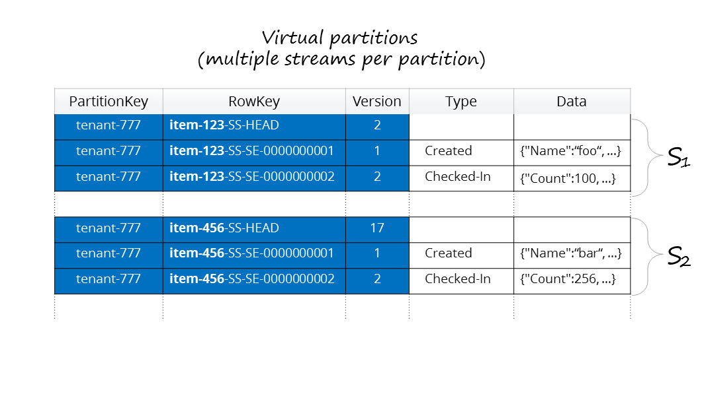

  

Streamstone is a small library targeted at building scalable event-sourced solutions on top of Windows Azure Table Storage. The API is specifically tailored for ease of consumption from within DDD/CQRS style applications.

## Features

+ Easy-to-use, functional style API
+ Fully consistent stream operations
+ Duplicate event detection (based on unique id)
+ Custom event and stream metadata
+ Allows including additional entities within a batch 
+ Virtual partitions support

## Schema

## Schema2

## Schema.GIF

